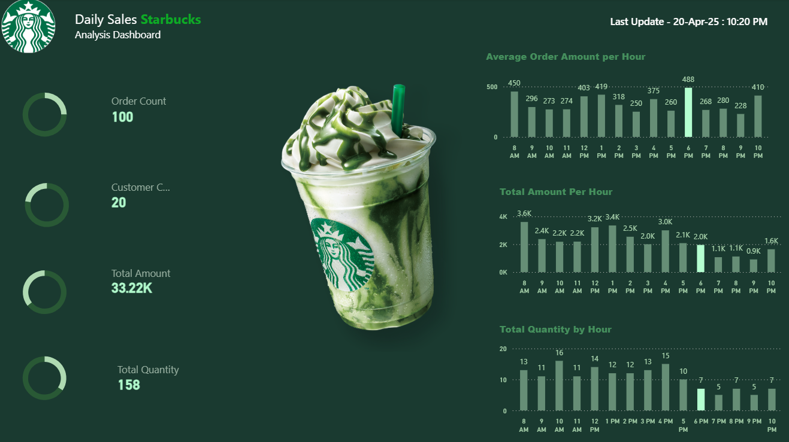

# ☕ Starbucks Daily Sales – Analysis Dashboard

A **Power BI + PostgreSQL** project built to analyze daily sales data for a Starbucks outlet — covering order trends, hourly revenue, customer behavior, and item-level performance.

> 🎯 Built as part of my data analyst job application portfolio.

---

## 📸 Dashboard Preview

### 🏠 Home


### 📊 Overview


### 📋 Detail


---

## 📌 Project Overview

This dashboard answers key business questions such as:

- What are the busiest hours of the day?
- How much revenue and quantity is sold per hour?
- Who are the top customers and what are they ordering?
- What is the split between new and regular customers?

---

## 📈 Key Insights

- **Total Orders:** 100 | **Total Quantity:** 158 | **Total Revenue:** ₹33,220
- **Peak Hour:** 6 PM — highest average order amount (₹488)
- **Morning Rush:** 8 AM leads in total hourly revenue (₹3.6K)
- **All transactions** were made via **Card payment**
- **Top items by revenue:** Caramel Macchiato, Frappuccino, Cheese Burger
- **Regular customers** account for a significant portion of repeat purchases

---

## 🗄️ PostgreSQL Schema

```sql
CREATE TABLE starbucks_sales (
    id              SERIAL PRIMARY KEY,
    customer_name   VARCHAR(100),
    item            VARCHAR(100),
    datetime        TIMESTAMP,
    customer_type   VARCHAR(20),    -- 'New' or 'Regular'
    payment_mode    VARCHAR(20),
    quantity        INT,
    amount          NUMERIC(10, 2)
);
```

---

## 🔍 SQL Queries

**Overall sales summary:**
```sql
SELECT
    COUNT(*)                        AS order_count,
    COUNT(DISTINCT customer_name)   AS customer_count,
    SUM(amount)                     AS total_amount,
    SUM(quantity)                   AS total_quantity
FROM starbucks_sales;
```

**Average order amount & revenue per hour:**
```sql
SELECT
    EXTRACT(HOUR FROM datetime)     AS hour,
    ROUND(AVG(amount), 2)           AS avg_order_amount,
    SUM(amount)                     AS total_amount,
    SUM(quantity)                   AS total_quantity
FROM starbucks_sales
GROUP BY EXTRACT(HOUR FROM datetime)
ORDER BY hour;
```

**Customer-level detail breakdown:**
```sql
SELECT
    customer_name,
    item,
    DATE(datetime)                  AS date,
    customer_type,
    payment_mode,
    SUM(amount)                     AS total_amount,
    SUM(quantity)                   AS total_quantity,
    ROUND(AVG(amount), 2)           AS avg_order_amount,
    COUNT(*)                        AS order_count
FROM starbucks_sales
GROUP BY customer_name, item, DATE(datetime), customer_type, payment_mode
ORDER BY customer_name;
```

**New vs Regular customer comparison:**
```sql
SELECT
    customer_type,
    COUNT(*)        AS order_count,
    SUM(amount)     AS total_revenue
FROM starbucks_sales
GROUP BY customer_type;
```

---

## 📐 DAX Measures

```dax
-- Total Revenue
Total Amount = SUM(starbucks_sales[amount])

-- Total Orders
Order Count = COUNT(starbucks_sales[id])

-- Total Quantity Sold
Total Quantity = SUM(starbucks_sales[quantity])

-- Average Order Amount
Avg Order Amount = AVERAGE(starbucks_sales[amount])

-- Total Unique Customers
Customer Count = DISTINCTCOUNT(starbucks_sales[customer_name])
```

---

## 🛠️ Tech Stack

| Tool | Purpose |
|------|---------|
| **Power BI Desktop** | Dashboard design & visualizations |
| **PostgreSQL** | Data storage & live querying |
| **DAX** | Calculated measures |
| **Power Query** | Connection configuration & query folding |

---

## ⚡ Direct Query Mode

This dashboard uses **Power BI Direct Query** — meaning **no data is imported or stored** in the `.pbix` file. Every chart and visual sends a live query directly to the PostgreSQL database when the report loads or a filter is applied.

**Benefits:**
- Always shows real-time, up-to-date data
- No data refresh schedule needed
- Suitable for large datasets

**Requirement:** An active connection to the PostgreSQL database is needed to view the dashboard.

---

## 📂 Repository Structure

```
starbucks-sales-dashboard/
├── README.md
├── Starbucks.pbix
├── starbucks_sales.sql
├── Home.png
├── Overview.png
└── Detail.png
```

---

## 🚀 How to Use

1. Clone this repository
   ```bash
   git clone https://github.com/your-username/starbucks-sales-dashboard.git
   ```
2. Set up your PostgreSQL database and run the schema script
   ```bash
   psql -U your_user -d your_database -f starbucks_sales.sql
   ```
3. Open `Starbucks.pbix` in **Power BI Desktop**
4. Update the PostgreSQL connection under **Home → Transform Data → Data Source Settings**
5. Enter your server, port, database name, and credentials
6. Since this uses **Direct Query**, Power BI will connect live — no import needed
7. Open the report and explore!

---

## 🙋 Author

**Aditya Shinde**
[](https://linkedin.com/in/linkedin.com/in/aditya-shinde-49b50524a)
[](https://github.com/Aditya-powerbi)

---


> **Last Updated:** April 2025 | Data as of 20-Apr-2025
